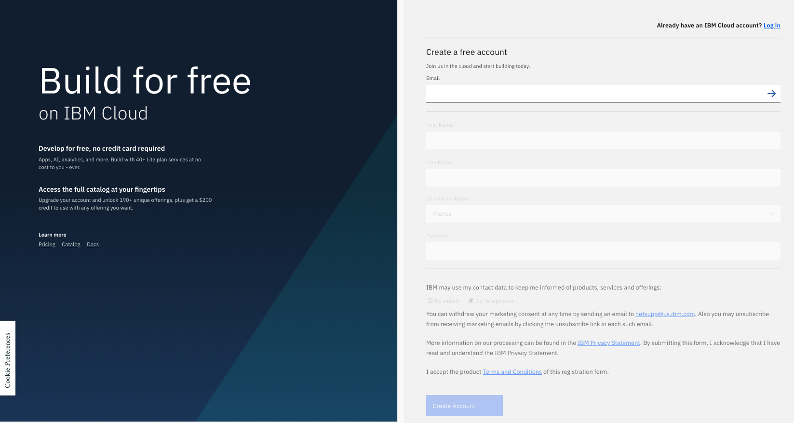
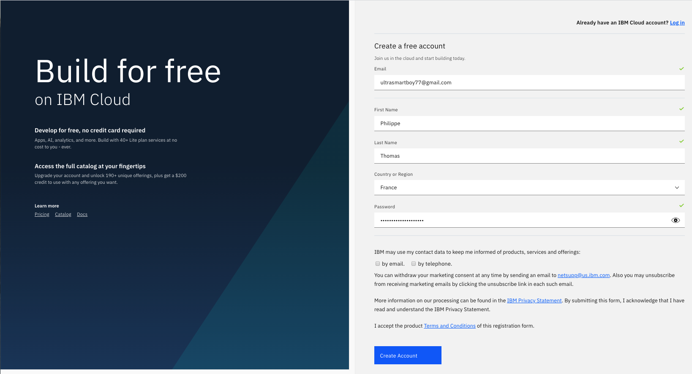
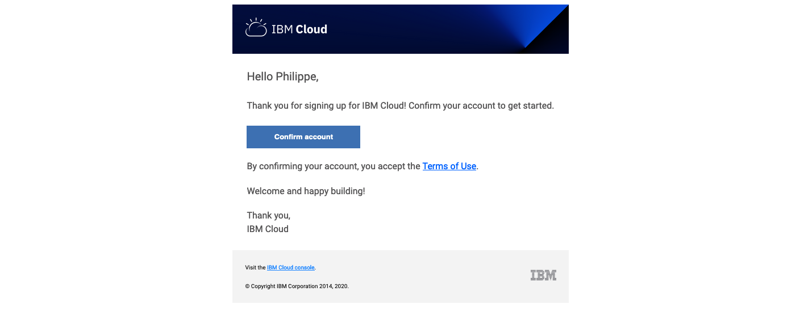
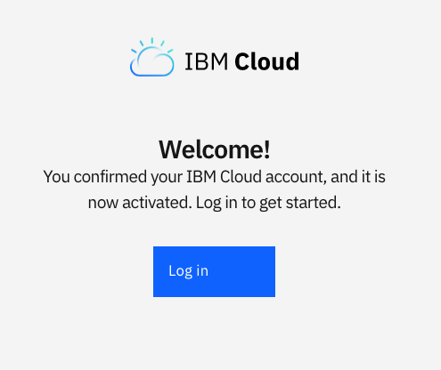
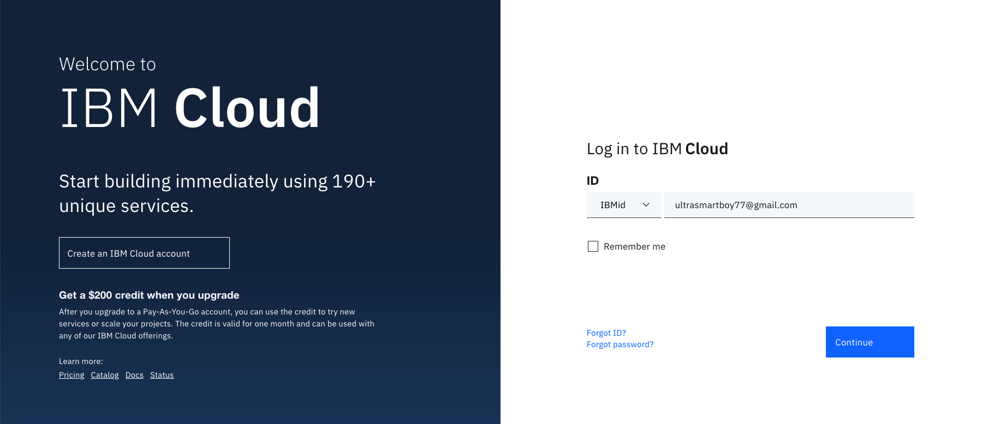

# IBM Hybrid Cloud Workshop
---
# Preparing labs
---


Before you can run all the labs about container orchestration, you should prepare your environment to execute those labs. Check the following instructions.

Labs are running on the **IBM Cloud** (ex Bluemix) and **IBM Cloud Private**.


# Task 1. IBM Cloud registration

**<u>Skip This task if you already have an IBM cloud account</u>** 

So before you can start any labs, you should have satisfied the following prerequisites :
- [ ] You should have **1 valid email** 

- [ ] Sign up to the **IBM Cloud** 


If you don't have a valid email address or if you don't want to use your personal or professional email address, please create an email account on GMAIL for instance. Don't use any temporary email.


### Sign in to IBM Cloud
If you don't have already registered to **IBM Cloud**,  
Open this link in your favorite internet browser.

<https://cloud.ibm.com/registration?target=https://cloud.ibm.com/docs>



### Fill in the form

Specify last name, first name, country, phone number and password.
> By **default**, all new people that register to IBM Cloud will have an **Lite Account** with **no time restriction**. This is not a 30 day trial account. 

Click on **Create Account** button.

 


Then if everything is fine, you will receive the following page:


### Confirm your registration to IBM Cloud from your inbox
From your email application , you should have received an email from the IBM Cloud:



Click on the link to confirm the account.

Log in to IBM Cloud with your credentials :



Then type your password and click **Continue**



Type your password and click Login button:


You should see the following **Dashboard**:


You are now connected (and registred) to the IBM Cloud.

> IMPORTANT : Take a note of your email address and your password.


# Task 2. Apply a promo code (if necessary)

<u>**Skip This task if you already have access to IBM Kubernetes Service**</u>

Check if you can access to **Kubernetes Service**.
To do so, click on **Catalog** and click on **Containers** on the left pane of the page :


> **IMPORTANT** : If you just see **Container Registry** and not the Containers in Kubernetes Clusters, then **you will need a promo code !!!**

> **IMPORTANT** : If you don't have a **promo code**, then ask IBM during the workshop. You can continue the other steps of this preparation and come back later to this step. However, to create a cluster, you will need a promo code.

To install a promo code, follow the procedure : 

Go to **Manage >Account > Account Settings** and press enter.


You should get the following section in the **account setting page**  :


Click **Apply Code** button.


Enter your **promo code** and click **Apply** 


> Close this window and **logout / login** to your account.

Go back to the **Catalog** and check that now you have access to **Kubernetes Service** and the Container Registry.


# Task 3. Install Git on your laptop


> **IMPORTANT** : There are 2 possibilities to run the labs : on you laptop or on the provided VM.
>
> **<u>Skip this task if you choosed to run labs on the provided VM.</u>**
>
> **<u>Skip This task if you already have Docker installed on your laptop</u>**


To install Git : 

On MacOS :
http://mac.github.com

On Windows: 
http://git-scm.com/download/win

At some point during the installation, change to the **"Use Windows default console"** and continue the installation.


# Task 4. Install the ibmcloud command

>  **IMPORTANT** :  <u>You must install the ibmcloud command on your laptop or on the provided VM depending of what you choose.</u>


The **ibmcloud** command line interface (CLI) provides a set of commands that are grouped by namespace for users to interact with IBM Cloud. In previous versions, the name of that command was "bluemix" or "bx".

Find more information here for more installation approaches :

<https://cloud.ibm.com/docs/cli/reference/ibmcloud?topic=cloud-cli-install-ibmcloud-cli#install_use>


**For MacOS :**

https://clis.cloud.ibm.com/download/bluemix-cli/latest/osx


**For Linux :**

`curl -fsSL https://clis.cloud.ibm.com/install/linux | sh`


**For Windows :**

https://clis.cloud.ibm.com/download/bluemix-cli/latest/win64


Then test your command (open a terminal or a command line) :	

` ibmcloud`


Install the 2 plugins :

```
ibmcloud plugin install kubernetes-service
ibmcloud plugin install container-registry
```

Results

```console
> ibmcloud plugin install kubernetes-service
Looking up 'kubernetes-service' from repository 'IBM Cloud'...
Plug-in 'container-service/kubernetes-service 0.2.99' found in repository 'IBM Cloud'
Do you want to update it with 'container-service/kubernetes-service 0.2.99' or not? [y/N]> y
Attempting to download the binary file...
 24.18 MiB / 24.18 MiB [=======================================] 100.00% 10s
25353300 bytes downloaded
Installing binary...
OK
Plug-in 'container-service 0.2.99' was successfully installed into /Users/phil/.bluemix/plugins/container-service. Use 'ibmcloud plugin show container-service' to show its details.

> ibmcloud plugin install container-registry
Looking up 'container-registry' from repository 'IBM Cloud'...
Plug-in 'container-registry 0.1.380' found in repository 'IBM Cloud'
Plug-in 'container-registry 0.1.373' was already installed. Do you want to update it with 'container-registry 0.1.380' or not? [y/N]> y
Attempting to download the binary file...
 3.33 MiB / 24.45 MiB [=========================================] 100.00% 43s
25640616 bytes downloaded
Installing binary...
OK
Plug-in 'container-registry 0.1.380' was successfully installed into /Users/phil/.bluemix/plugins/container-registry. Use 'ibmcloud plugin show container-registry' to show its details.

```

Check your commands:

  `ibmcloud cr`


 `ibmcloud ks` 


# Task 5. Login to IBM Cloud

Login to IBM Cloud with the ibmcloud command :

 `ibmcloud login -a cloud.ibm.com -r eu-gb`

 And answer a few questions: email, password :

```bash
# ibmcloud login -a cloud.ibm.com -r eu-gb
API endpoint: https://cloud.ibm.com
Region: us-south

Email> thomas1@fr.ibm.com

Password> 
Authenticating...
OK

Targeted account Philippe THOMAS's Account (8181f93cf3b74ab762ed34a6523)

Targeted resource group default

Targeted region eu-gb

                      
API endpoint:      https://cloud.ibm.com   
Region:            eu-gb   
User:              thomas1@fr.ibm.com   
Account:           Philippe THOMAS's Account (8181f93cf3b742b762ed34a6523)   
Resource group:    default   
CF API endpoint:      
Org:                  
Space:                

Tip: If you are managing Cloud Foundry applications and services
- Use 'ibmcloud target --cf' to target Cloud Foundry org/space interactively, or use 'ibmcloud target --cf-api ENDPOINT -o ORG -s SPACE' to target the org/space.
- Use 'ibmcloud cf' if you want to run the Cloud Foundry CLI with current IBM Cloud CLI context.


```

**You are now ready to start the other labs**.


# Task 6. Conclusion

###  Results
<span style="background-color:yellow;">Successful exercise ! </span>
You finally went thru the following features :
- [x] You registered to IBM Cloud
- [x] You applied a promo code
- [x] You installed Git
- [x] You installed the ibmcloud commands
- [x] You login to IBM Cloud successfully
- [x] You are ready for the labs
---
# End of the lab
---
# IBM Hybrid Cloud Workshop
---
