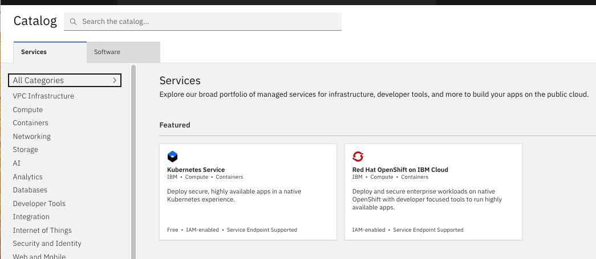
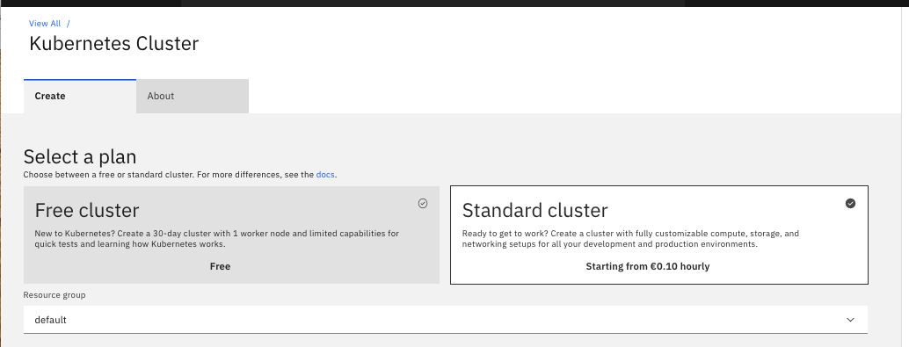
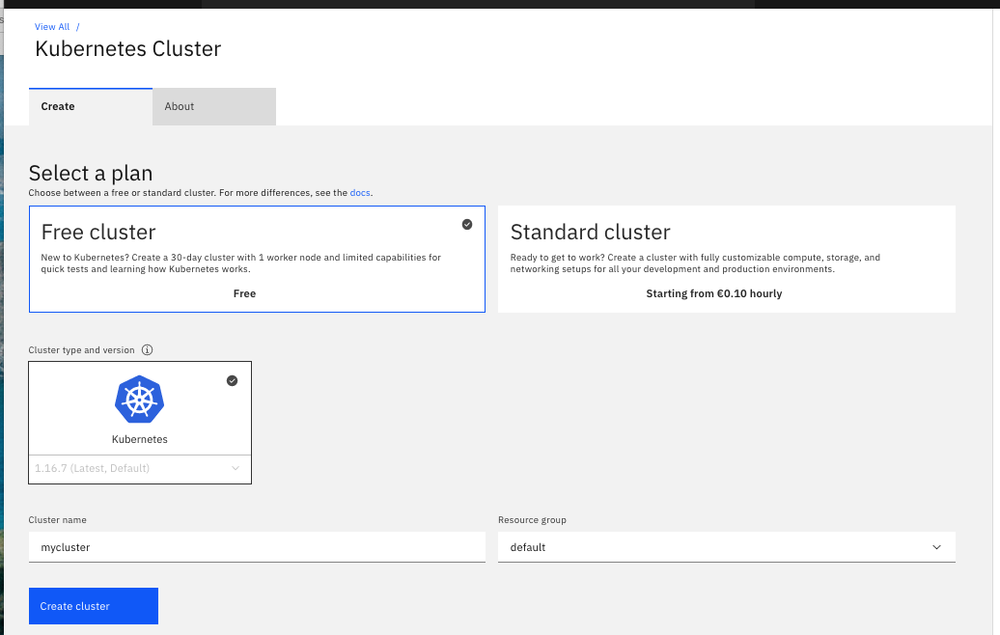
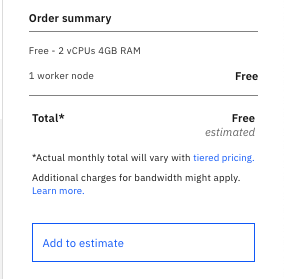
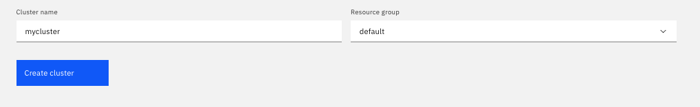
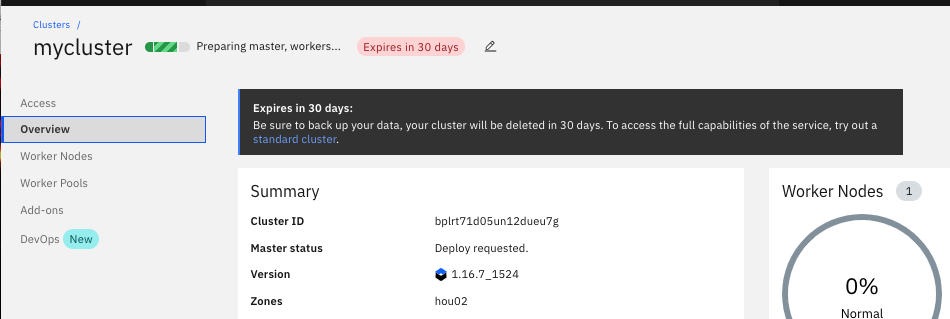
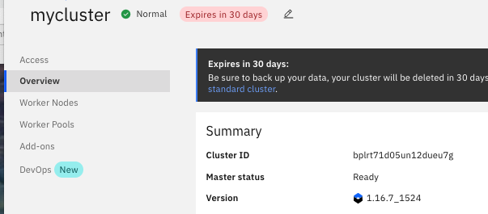
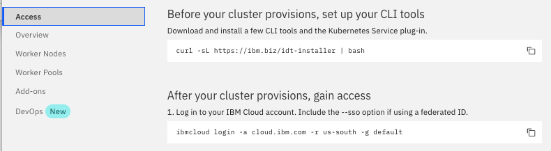
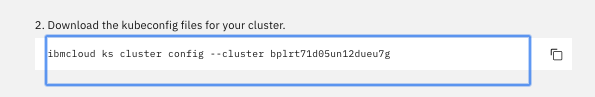
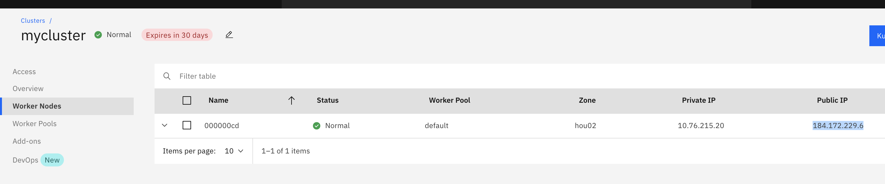

# IBM Hybrid Cloud Workshop

---
# Kubernetes Service (IKS) Lab
---


# Introduction to IKS

IBM Cloud Kubernetes Service combines Docker and Kubernetes to deliver powerful tools, an intuitive user experience, and built-in security and isolation to automate the deployment, operation, scaling, and monitoring of containerized apps over a cluster of independent compute hosts by using the Kubernetes APIs.

## Docker containers

Docker is an open source project that was released by dotCloud in 2013. Built on features of the existing Linux container technology (LXC), Docker became a software platform that you can use to build, test, deploy, and scale apps quickly. Docker packages software into standardized units that are called containers that include all of the elements that an app needs to run.

Review these concepts to learn about basic Docker concepts.

**Container**

A container is a standard way to package an app and all its dependencies so that the app can be moved between environments and run without changes. Unlike virtual machines, containers do not virtualize a device, its operating system, and the underlying hardware. Only the app code, run time, system tools, libraries, and settings are packaged inside the container. Containers run as isolated processes on the compute host where they are deployed to and share the host operating system and its hardware resources. This approach makes a container more lightweight, portable, and efficient than a virtual machine.

**Image**

Every container is based on a Docker image and is considered to be an instance of an image. An image is built from a Dockerfile, which is a file that contains instructions how to build the image, and any build artifacts, such as an app, the app's configuration, and its dependencies.

**Registry**

An image registry is a place where you store, retrieve, and share Docker images. Images that are stored in a registry can either be publicly available (public registry) or accessible by a small group of users only (private registry). IBM Cloud Kubernetes Service offers public images, such as ibmliberty that you can use to get started with Docker and Kubernetes to create your first containerized app in a cluster. When it comes to enterprise applications, use a private registry like the one provided in IBM Cloud to protect your images from being used and changed by unauthorized users. 

When you want to deploy a container from an image, you must make sure that the image is stored in either a public or private image registry.

## Kubernetes

Kubernetes was developed by Google as part of the Borg project and handed off to the open source community in 2015. Kubernetes combines more than 15 years of Google research in running a containerized infrastructure with production work loads, open source contributions, and Docker container management tools to provide an isolated and secure app platform that is portable, extensible, and self-healing in case of failovers.

Learn about the basics of how Kubernetes works with a little terminology.


**Cluster**

A Kubernetes cluster consists of one or more virtual machines that are called worker nodes. Every worker node represents a compute host where you can deploy, run, and manage containerized apps. Worker nodes are managed by a Kubernetes master that centrally controls and monitors all Kubernetes resources in the cluster. When you deploy a containerized app, the Kubernetes master decides where to deploy the app, taking into account the deployment requirements and available capacity in the cluster.

**Pod**

Every containerized app that is deployed into a Kubernetes cluster is deployed, run, and managed by a pod. Pods represent the smallest deployable units in a Kubernetes cluster and are used to group containers that must be treated as a single unit. In most cases, a container is deployed to its own pod. However, an app might require a container and other helper containers to be deployed into one pod so that those containers can be addressed by using the same private IP address.

**Deployment**

A deployment is a Kubernetes resource where you specify your containers and other Kubernetes resources that are required to run your app, such as persistent storage, services, or annotations. Deployments are documented in a Kubernetes deployment script. When you run a deployment, the Kubernetes master deploys the specified containers into pods taking into account the capacity that is available on the worker nodes of the cluster. Other Kubernetes resources are created and configured as specified in the deployment script. 

You can use a deployment to define update strategies for your app, which includes the number of pods that you want to add during a rolling update and the number of pods that can be unavailable at a time. When you perform a rolling update, the deployment checks whether the revision is working and stops the rollout when failures are detected.

**Service**

A Kubernetes service groups a set of pods and provides network connection to these pods for other services in the cluster without exposing the actual private IP address of each pod. You can use a service to make your app available within your cluster or to the public internet. 

With IBM Cloud Kubernetes Service (IKS), you can define complex architectures that implement resiliency, high availability and replication between data centers and regions (also called AZ – availability zones).  


# Task 1 : Create your first IKS cluster

Kubernetes is an orchestration tool for scheduling app containers onto a cluster of compute machines. With Kubernetes, developers can rapidly develop highly available applications by using the power and flexibility of containers.

Before you can deploy an app by using Kubernetes, start by **creating a cluster**. A cluster is a set of worker nodes that are organized into a network. The purpose of the cluster is to define a set of resources, nodes, networks, and storage devices that keep applications highly available.

To create a lite cluster:


## 1.  Select the IBM Kubernetes Service	

From the Catalog, in the Containers category, click on **Kubernetes Service**.




## 2. Create the service

To use that service, click the **Free Cluster** tile:




## 3. Define a free Cluster

Select **Free** for the cluster type :



Keep **mycluster** as the name of your cluster

The default cluster type is standard. So you have to select the **free** cluster type. Next time, you can create a standard cluster and define additional customizations, like how many worker nodes are in the cluster.





## 4. Create the cluster 

Click on the **Create Cluster** button:



The details for the cluster open, but the worker node in the cluster takes a few minutes (**around 10 minutes**) to provision. You can see the status of the worker node in the Worker nodes tab. When the status reaches Ready, your worker node is ready to be used. A green light will appear.

Click on **overview** (on the left side).




## 5.	What is a lite cluster ?  

The lite cluster has one worker node with 2 CPU and 4 GB memory available for your apps to use for one month.

The worker node is centrally monitored and managed by a dedicated and highly available **IBM-owned Kubernetes master** that controls and monitors all of the Kubernetes resources in the cluster. You can focus on your worker node and the apps that are deployed in the worker node without worrying about managing this master too.

The resources that are required to run the cluster, such as **VLANS and IP addresses**, are managed in an **IBM-owned IBM Cloud** Infrastructure (SoftLayer) account. When you create a standard cluster, you manage these resources in your own IBM Cloud Infrastructure (SoftLayer) account. You can learn more about these resources when you create a standard cluster.

**Tip**: Lite clusters that are created with a IBM Cloud free trial account are **automatically removed** after the free trial period ends, unless you upgrade to a IBM Cloud Pay-As-You-Go account.


# Task 2 : Prepare your environment

Deploy and manage your own Kubernetes cluster in the cloud. You can automate the deployment, operation, scaling, and monitoring of containerized apps in a cluster of independent compute hosts called worker nodes.

**To set up the infrastructure:**
•	Install all the CLIs for using the Kubernetes API and managing Docker images
•	Create a private image repository in IBM Cloud Container Registry to store your images

It can take 10 minutes to provision your cluster. To make the most of your time, create your cluster before installing all the CLIs. 

On your laptop, you have to prepare your environment to be ready to use Kubernetes and your cluster **mycluster**.


### 1. Check ibmcloud plugins

`ibmcloud plugin list`

Results: 

```bash
# ibmcloud plugin list
Listing installed plug-ins...

Plugin Name          Version   
container-registry                     0.1.454   
container-service/kubernetes-service   0.4.102    
```

If necessary update the plugins to the latest versions:

`ibmcloud update all`


### 2. Install kubectl command line on your laptop

This command (kubectl) will be used to control kubernetes. For more information on installation, go to this link:

<https://kubernetes.io/docs/tasks/tools/install-kubectl/>

#### MacOS installation

1. Download the latest release:

   ```
   curl -LO https://storage.googleapis.com/kubernetes-release/release/v1.15.5/bin/darwin/amd64/kubectl
   ```

   Make the kubectl binary executable.

   ```
   chmod +x ./kubectl
   ```

2. Move the binary in to your PATH.

   ```
   sudo mv ./kubectl /usr/local/bin/kubectl
   ```

3. Test to ensure the version

   ```
   kubectl version --short --client=true 
   ```

#### Windows 10 Pro installation

1. Go to the following link:

https://storage.googleapis.com/kubernetes-release/release/v1.15.5/bin/windows/amd64/kubectl.exe

1. Move this binary (kubectl.exe) to a directory that is already in your **path** like "C:\Program Files\IBM\Cloud\bin\"

1. Test to ensure the version

```
kubectl version --short --client=true
```

Results:

```**kubectl version --short  --client=true** 
kubectl version --short  --client=true 
Client Version: v1.15.5
```

Type the following command :

`kubectl version --short`

And you should get version for your client and server :

``` bash
# kubectl version --short
Client Version: v1.16.7
error: You must be logged in to the server (the server has asked for the client to provide credentials)
```

The error at the end is **normal** because we need to specify how to connect to the master (see below).


### 5. Gain access to the cluster

**IMPORTANT** : At this point, your cluster should have been started. Check in the IBM Cloud Console



Get access to your cluster : go to the Access link

 


Log into your IBM Cloud account if no already logged in.

`ibmcloud login -a <API-login-end-point> -r <region> -g <groupe>`

> where the <API-login-end-point> and <region>  are shown.

For example:

`ibmcloud login -a cloud.ibm.com -r eu-gb -g default `

Check your cluster:

`ibmcloud ks clusters`

Results:

```bash
# ibmcloud ks clusters
OK
Name        ID                     State    Created          Workers   Location   Version       Resource Group Name   Provider   
mycluster   bplrt71d05un12dueu7g   normal   38 minutes ago   1         Dallas     1.16.7_1524   default               classic   
```


Download the kubeconfig files for your cluster with the command from the Access page (step2):



`ibmcloud ks cluster config --cluster <cluster-id>`

Output:

``` bash
# ibmcloud ks cluster config --cluster bplrt71d05un32dueu7g
WARNING: The behavior of this command in your current CLI version is deprecated, and becomes unsupported when CLI version 1.0 is released in March 2020. To use the new behavior now, set the 'IKS_BETA_VERSION' environment variable. In bash, run 'export IKS_BETA_VERSION=1'.
Note: Changing the beta version can include other breaking changes. For more information, see 'https://ibm.biz/iks-cli-v1'

OK
The configuration for bplrt71d05un12dueu7g was downloaded successfully.

Export environment variables to start using Kubernetes.

export KUBECONFIG=/Users/phil/.bluemix/plugins/container-service/clusters/bplrt71d05un12dueu7g/kube-config-hou02-mycluster.yml
```


**IMPORTANT** : Cut, paste and execute the KUBECONFIG line at the end of the previous command to setup which cluster you want to access. 

```
export KUBECONFIG=/Users/phil/.bluemix/plugins/container-service/clusters/bplrt71d05un12dueu7g/kube-config-hou02-mycluster.yml
```


Verify that you can connect to your cluster by listing your worker nodes.

 `kubectl get nodes`

 The output should be :

```con
$ kubectl get nodes
NAME           STATUS   ROLES    AGE     VERSION
10.76.215.20   Ready    <none>   6h29m   v1.16.7+IKS
```


**YOU ARE NOW CONNECTED TO YOUR IKS CLUSTER**.


# Task 3 : Creating a private registry

Set up your own private image repository in IBM Cloud Container Registry to securely store and share Docker images with all cluster users. A private image repository in IBM Cloud is identified by a **namespace**. The namespace is used to create a unique URL to your image repository that developers can use to access private Docker images.

We choose a unique name as our namespace to group all images in our account. **Replace <your_namespace> with a namespace of your choice** and not something that is related to the tutorial.

```
ibmcloud cr namespace-add <my_namespace>
```

Results:

```bash
# ibmcloud cr namespace-add ireg        
Adding namespace 'ireg'...
Successfully added namespace 'ireg'
OK
```

Now login to the IBM Cloud registry:

`ibmcloud cr login`

Output:

```bash
# ibmcloud cr login
Logging in to 'registry.eu-gb.bluemix.net'...
Logged in to 'registry.eu-gb.bluemix.net'.

Logging in to 'uk.icr.io'...
Logged in to 'uk.icr.io'.

OK
```

Take a note of the Doker registry name: **uk.icr.io** 


To test our new **private registry**, List the images in the private registry

`ibmcloud cr image-list`

```bash
# ibmcloud cr image-list
Listing images...

Repository                        Tag      Digest         Namespace   Created       Size     Security status   
uk.icr.io/imgreg/hello-world   1        221c39dc0d39   image_hub   2 years ago   268 MB  
```


# Task 4 : Deploy a simple app (optional)

For this tutorial, we have taken a simple Hello World! Node.js application to deploy on Kubernetes as shown. The following is code from our sample app; use one that you have on hand.

``` javascript
  const app = require('express')()

  app.get('/', (req, res) => {
    res.send("Hello from Appsody!");
  });

  var port = 3300;

  var server = app.listen(port, function () {
    console.log("Server listening on " + port);
  })

  module.exports.app = app;
```

Create and clone a github repo:

```
cd
mkdir deploy
cd deploy
git clone https://github.com/IBM/deploy-app-using-tekton-on-kubernetes deploy-app
cd deploy-app/src
```

Check your IBM Cloud registry:

```bash
ibmcloud cr api
```

Results

```bash
# ibmcloud cr api
                           
Registry API endpoint   https://uk.icr.io/api   

OK
```

Take a note of the registry. In that case **uk.icr.io**

Build and push it to IBM Cloud Container registry.

```
ibmcloud cr build -t uk.icr.io/<namespace>/builtApp:1.0 .
```

Results

```bash
# ibmcloud cr build -t uk.icr.io/ireg/hello:1.0 .
Sending build context to Docker daemon   5.12kB
Step 1/7 : FROM node:alpine
 ---> b01d82bd42de
Step 2/7 : COPY app.js /app/app.js
 ---> Using cache
 ---> 962052c0ed3b
Step 3/7 : COPY package.json /app/package.json
 ---> Using cache
 ---> 2bdbf3d2d97c
Step 4/7 : RUN cd /app && npm install
 ---> Using cache
 ---> dc1810bd90ae
Step 5/7 : ENV WEB_PORT 3300
 ---> Using cache
 ---> 92ff94d39dc1
Step 6/7 : EXPOSE  3300
 ---> Using cache
 ---> c7c9ac470b16
Step 7/7 : CMD ["node", "/app/app.js"]
 ---> Using cache
 ---> d96b8cee6467
Successfully built d96b8cee6467
Successfully tagged uk.icr.io/ireg/hello:1.0
The push refers to repository [uk.icr.io/ireg/hello]
debddb1b4cb1: Pushed 
568966cbd2fb: Pushed 
54e067222fef: Pushed 
85b69ca8f2a0: Pushed 
f9ad34829dbf: Pushed 
de5315d732c2: Pushed 
5216338b40a7: Pushed 
1.0: digest: sha256:884c4a49042459477a5d8a4620d0a6e66a1de490ab6b8795bcf4deaf994e237a size: 1783

OK
```

Verify whether the image is uploaded to the container registry

```bash
ibmcloud cr images
```

```bash
# ibmcloud cr images
uk.icr.io/ireg/hello              1.0      884c4a490424   ireg        4 minutes ago   48 MB    No Issues   
```


Update deploy target in deploy.yaml

```
sed -i '' s#IMAGE#uk.icr.io/<namespace>/hello:1.0# deploy.yaml
```

Results:

```yaml
more deploy.yaml
apiVersion: v1
kind: Service
metadata:
  name: app
  labels:
    app: app
spec:
  type: NodePort
  ports:
    - port: 3300
      name: app
      nodePort: 32426
  selector:
    app: app
---
apiVersion: apps/v1
kind: Deployment
metadata:
  name: app
  labels:
    app: app
spec:
  replicas: 1
  selector:
    matchLabels:
      app: app
  template:
    metadata:
      labels:
        app: app
    spec:
      containers:
      - name: app
        image: uk.icr.io/ireg/hello:1.0
        ports:
        - containerPort: 3300
```

Run deploy configuration

```bash
kubectl create -f deploy.yaml
```

Results

```bash
# kubectl create -f deploy.yaml
service/app created
deployment.apps/app created
```

Verify output - pod and service should be up and running

```bash
# kubectl get pods
NAME                  READY   STATUS    RESTARTS   AGE
app-d78b485cb-567ql   1/1     Running   0          81s

# kubectl get service
NAME         TYPE        CLUSTER-IP      EXTERNAL-IP   PORT(S)          AGE
app          NodePort    172.21.43.135   <none>        3300:32426/TCP   116s
```

Retrieve the public IP of a Kubernetes cluster from your IBM Cloud dashboard



In a browser use the following URL: 

```http
http://184.172.229.6:32426
```

Results:


# Conclusion

You have learnt how to create a Kubernetes cluster and see how to configure all the necessary tools (CLI, connection) to manage a cluster and the kubernetes resources (PODs, Services). And you have deployed  an application in that kubernetes cluster !

# End of the lab

------

# IBM Hybrid Cloud Workshop


---